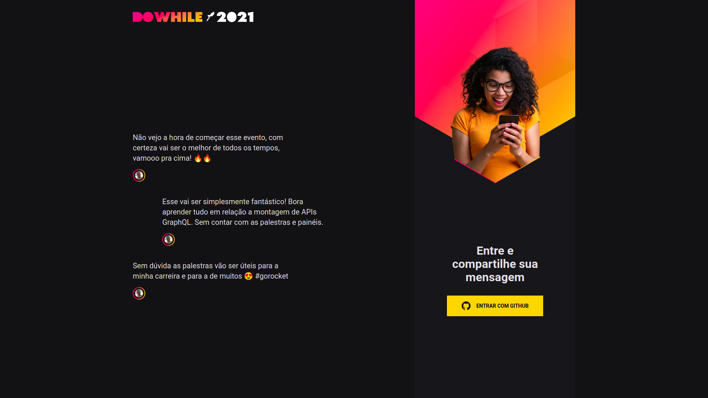
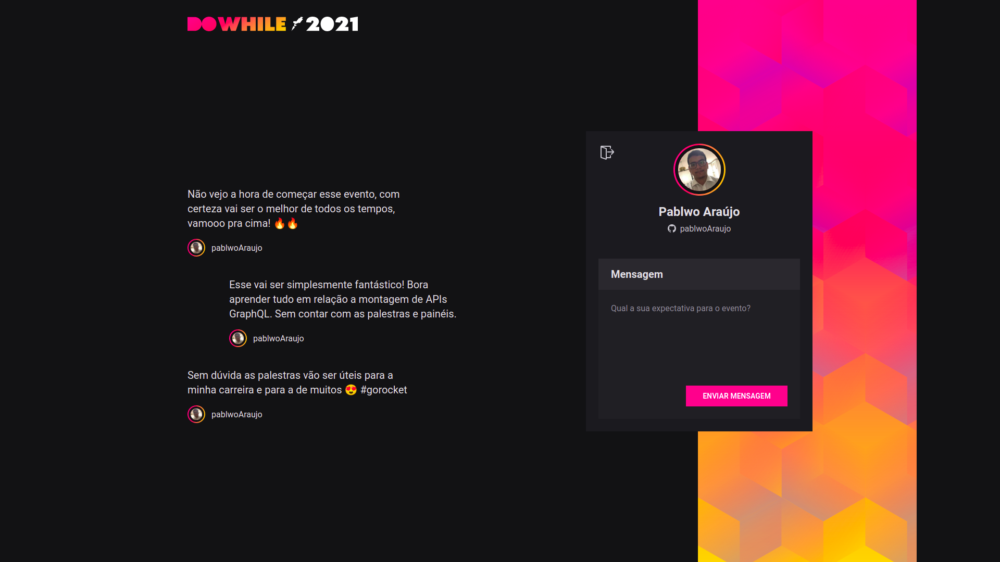
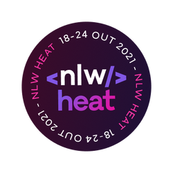

<div align="center">
    
</div>

<br/>

<p align="center">
  

  
  
  <a href="https://github.com/pablwoAraujo/web_heat/commits/master">
    
  </a>

  <a href="https://github.com/pablwoAraujo/web_heat/issues">
    
  </a>

  
</p>

<p align="center">
  <a href="#tecnologias">Tecnologias</a>&nbsp;&nbsp;&nbsp;|&nbsp;&nbsp;&nbsp;
  <a href="#sobre-o-projeto">Sobre o projeto</a>&nbsp;&nbsp;&nbsp;|&nbsp;&nbsp;&nbsp;
  <a href="#como-rodar-o-projeto">Como rodar o projeto</a>
</p>

## 🚀 Tecnologias

Esse projeto foi desenvolvido com as seguintes tecnologias:

- [React](https://reactjs.org)
- [Vite](https://vitejs.dev/)

## 💻 Sobre o projeto

DoWhile2021 é uma aplicação onde as pessoas podem compartilhar suas expectativas sobre o DoWhile.




## Como rodar o projeto

```
# Clone este repositório
$ git clone https://github.com/pablwoAraujo/web_heat.git

# Acesse a pasta do projeto
$ cd web_heat

# Instale as dependências
$ yarn

# Execute a aplicação 
$ yarn dev
```

<div align="center">
  
</div>


> Projeto desenvolvido na missão Impulse do [NLW Heat](https://nextlevelweek.com/)